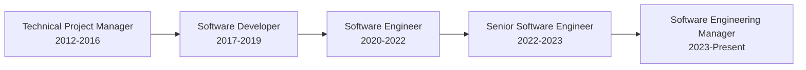

# Hi there, I'm Muhammad Awais 👋

  

## 🚀 About Me

I'm a **Dynamic Software Engineer** with over **14 years of diverse experience** driving technical innovation and team excellence across enterprise-level software development projects. Currently serving as **Software Engineering Manager at Codonomy**, I specialize in leading high-performing teams, implementing robust technology strategies, and ensuring the delivery of high-quality solutions that align with business objectives.

### 💼 Current Role
**Software Engineering Manager @ Codonomy** *(Nov 2023 - Present)*
- 🎯 Collaborating with CTO to define and execute technical strategy
- 👥 Leading and managing technology teams with focus on recruitment, training, and performance
- 🛡️ Maintaining and enhancing stability, security, and scalability of technology infrastructure
- 🤝 Partnering with cross-functional teams to meet business requirements and market demands

## 🛠️ Technical Stack

### **Languages & Frameworks**

### **Frontend Technologies**

### **Backend & APIs**

### **Cloud & DevOps**

### **Databases**

### **Tools & Methodologies**

## 📊 Core Competencies

<table>
<tr>
<td width="50%">

### 👨‍💼 Leadership & Management
- ✅ Team Leadership (5-15 members)
- ✅ Strategic Planning & Execution
- ✅ Agile Project Management
- ✅ Cross-Functional Collaboration
- ✅ Stakeholder Management
- ✅ Technical Defense & Client Relations

</td>
<td width="50%">

### 💻 Technical Excellence
- ✅ Full-Stack Development
- ✅ Clean Architecture & Design Patterns
- ✅ Test-Driven Development (TDD)
- ✅ CI/CD Pipeline Configuration
- ✅ Cloud Infrastructure (AWS, Azure)
- ✅ Microservices Architecture

</td>
</tr>
</table>

## 🏆 Professional Journey

### 📈 Career Highlights

- **🚀 14+ Years** of progressive experience in software development and team leadership
- **👥 Managed 12-15 clients** providing solution and development services at Cloudtek
- **🎯 Led teams of 5-15 developers** across multiple projects and organizations
- **💡 Implemented** Clean Architecture, N-Layer Architecture, and Design Patterns
- **🔧 Expertise in** .NET ecosystem, Angular 17, React 18, and cloud technologies
- **📊 Proficient in** Agile methodologies, TDD, and DevOps practices

## 🌟 What I'm Currently Focusing On

- 🔭 Building scalable enterprise-level web applications
- 🌱 Continuously learning and implementing cutting-edge technologies
- 👯 Looking to collaborate on innovative open-source projects
- 🎯 Driving technical excellence and team productivity at Codonomy
- 💡 Implementing robust technology strategies aligned with business objectives

## 📚 Education

**Bachelor's in Computer Engineering**  
*COMSATS University, Islamabad (2007 - 2012)*

## 🤝 Let's Connect!

  

---

  
  
  ### 💭 "Committed to leveraging technical expertise to optimize performance and scalability while maintaining a focus on innovation and quality."

